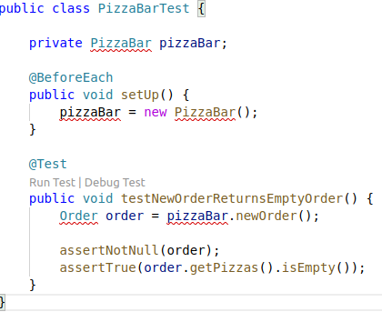
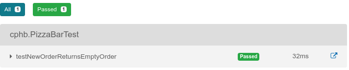
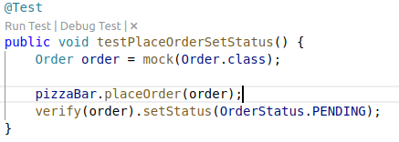
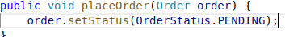
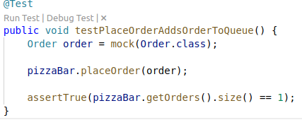

# Links

- [Assignment 6](https://github.com/datsoftlyngby/soft2019spring-test/blob/master/Assignments/06%20TDD%20assignment.pdf)
- [Junit 5](https://junit.org/junit5/docs/current/user-guide/)
- [Mockito](https://static.javadoc.io/org.mockito/mockito-core/2.27.0/org/mockito/Mockito.html)

# Assignment

## TDD 
I started with a simple test:


To be able to run this test(go from red to green), I created `PizzaBar`, `Pizza` and `Order` classes, made `newOrder` return a new order object and `getPizzas` return an list of pizzas. This gave my first green: 


Next I decided to take a bigger step and write a test for `placeOrder`. This method should add the order to the list of orders, and set the orders state to indicate that it is new using an enumeration. Again I started with a failing test:


One line implementation was enough to get back into the green again:


This test was a behavior driven one, that is I only assert that the `setStatus` was called with the correct parameters. It made me realize that I also should test the state of the pizza bar after adding a new order, after all what's the point of having a pending order if nobody knows about it. I started with another failing test(image below), note that I skipped the iteration where I just write the methods, instead I created the method and made it return an empty list of integers to satisfy the compiler.


At this point it became perfectly clear: the `PizzaBar` should maintain a list of its orders and add the new order to it everytime `placeOrder` is called. 

Note also that I used a mock for the order, even though I am only asserting whether the order gets added. That is because I don't care about the order itself in this test, and mocking it _could_ be easier if it had a constructor that takes many arguments.

## Inversion of control

At this point the pizza bar was functional, but one of the many(oh so many) problems was that it stored all the orders in memory. If poor Mario would accidently restart his computed, all the orders would be lost. Therefore I decided it needs a better solution for that, although I also wanted to keep the in memory storage since it is useful in testing. _Conveniently_, this is a great opportunity to practice inversion of control with dependency injection... And would you look at that?! It is also a part of this assignment. Convenient.

I defined an interface for what I want out of this [order storage](src/main/java/cphb/OrderDataStore.java):
```
public interface OrderDataStore {

    public boolean addOrder(Order order);
    
    public List<Order> getOrders();
    
    public boolean removeOrder(Order order);
}```

There are two classes implementing that interface: [InMemoryOrderDataStore](src/main/java/cphb/InMemoryOrderDataStore.java) and [DatabaseOrderDataStore](src/main/java/cphb/DatabaseOrderDataStore.java), the latter not fully implemented because this is taking too long. 

There are many containers available out there, but since this is a school assignment, why not make my own? You can find it under [Container](src/main/java/cphb/Container.java). It is a very basic one: it reads a file called `container-data.json` which contains a mapping between interfaces and implementation(not in Java terms, it can both be concrete classes). Merely changing the file, will change the `OrderDataStore` implementation. 

The `PizzaBar` class was also changed to take an instance of `OrderDataStore` as a constructor argument, since it is not its responsibility to figure out HOW to instantiate that class. 


That is all.